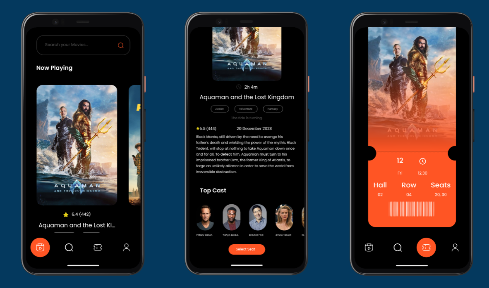

# Portfolio v2.0

TIntroducing Sinema, a cutting-edge mobile app that stands as a testament to my front-end development prowess. Crafted with React Native and TypeScript, this movie app seamlessly blends technology and aesthetics to deliver a captivating user experience. The fusion of TypeScript and carefully chosen React Native libraries ensures not just functionality but an elegant and efficient execution. Explore the world of cinema through a lens of innovation, showcasing the power of React Native and my commitment to pushing the boundaries of front-end development.



## Built With

- React-Native
- TypeScript
- Various React Libraries

# Getting Started

> **Note**: Make sure you have completed the [React Native - Environment Setup](https://reactnative.dev/docs/environment-setup) instructions till "Creating a new application" step, before proceeding.

## Step 1: Start the Metro Server

First, you will need to start **Metro**, the JavaScript _bundler_ that ships _with_ React Native.

To start Metro, run the following command from the _root_ of your React Native project:

```bash
# using npm
npm start

# OR using Yarn
yarn start
```

## Step 2: Start your Application

Let Metro Bundler run in its _own_ terminal. Open a _new_ terminal from the _root_ of your React Native project. Run the following command to start your _Android_ or _iOS_ app:

### For Android

```bash
# using npm
npm run android

# OR using Yarn
yarn android
```

### For iOS

```bash
# using npm
npm run ios

# OR using Yarn
yarn ios
```

If everything is set up _correctly_, you should see your new app running in your _Android Emulator_ or _iOS Simulator_ shortly provided you have set up your emulator/simulator correctly.

This is one way to run your app — you can also run it directly from within Android Studio and Xcode respectively.

## Authors

👤 **Author 1**

- GitHub: [daudi13](https://github.com/daudi13)
- Website: []()
- LinkedIn: [LinkedIn]()

## 🤝 Contributing

Contributions, issues, and feature requests are welcome!

Feel free to check the [issues page](../../issues/).

## Show your support

Give a ⭐️ if you like this project!

## 📝 License

This project is [MIT](./LICENSE) licensed.
